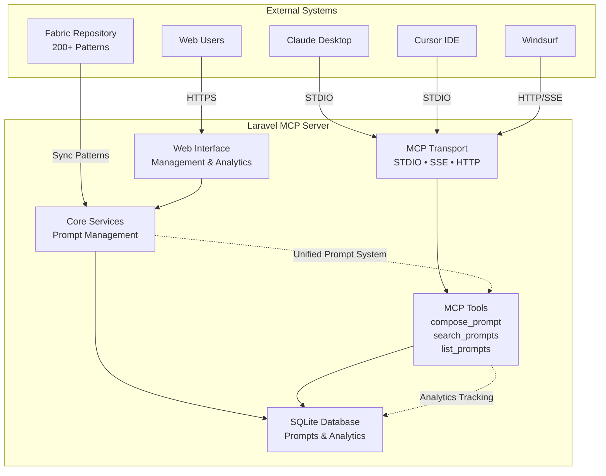

```mermaid
graph TB
    subgraph External["External Systems"]
        FabricRepo["Fabric Repository<br/>200+ Patterns"]
        Claude["Claude Desktop"]
        Cursor["Cursor IDE"]
        Windsurf["Windsurf"]
        WebUsers["Web Users"]
    end
    
    subgraph Laravel["Laravel MCP Server"]
        direction TB
        Transport["MCP Transport<br/>STDIO • SSE • HTTP"]
        WebInterface["Web Interface<br/>Management & Analytics"]
        Core["Core Services<br/>Prompt Management"]
        Database["SQLite Database<br/>Prompts & Analytics"]
        Tools["MCP Tools<br/>compose_prompt<br/>search_prompts<br/>list_prompts"]
    end
    
    %% External connections
    FabricRepo -->|"Sync Patterns"| Core
    WebUsers -->|"HTTPS"| WebInterface
    Claude -->|"STDIO"| Transport
    Cursor -->|"STDIO"| Transport  
    Windsurf -->|"HTTP/SSE"| Transport
    
    %% Internal flows
    Transport --> Tools
    WebInterface --> Core
    Core --> Database
    Tools --> Database
    
    %% Labels
    Core -.->|"Unified Prompt System"| Tools
    Tools -.->|"Analytics Tracking"| Database
```