```mermaid
graph TB
    %% External Systems
    FabricRepo[("🔗 Fabric GitHub Repository<br/>danielmiessler/fabric<br/>200+ AI Patterns")]
    Claude[("💬 Claude Desktop<br/>AI Assistant")]
    Cursor[("⚡ Cursor IDE<br/>AI Assistant")]
    Windsurf[("🌊 Windsurf<br/>AI Assistant")]
    OtherMCP[("🤖 Other MCP Clients<br/>AI Assistants")]
    
    %% Core Laravel Application
    subgraph Laravel["🚀 Laravel MCP Server Application"]
        direction TB
        
        %% Transport Layer
        subgraph Transport["🌐 MCP Transport Layer"]
            STDIO["📡 STDIO Transport"]
            SSE["📺 SSE Transport"]
            HTTP["🌍 HTTP Transport"]
        end
        
        %% Core Services
        subgraph Services["⚙️ Core Services"]
            MCPToolkit["🛠️ MCP Toolkit<br/>Pattern Tool Registry"]
            PatternService["🔄 Fabric Pattern Service<br/>Sync & Execution"]
            SyncSystem["⏰ Pattern Sync System<br/>Real-time Updates"]
        end
        
        %% Data Layer
        subgraph Data["💾 Data Layer"]
            SQLite[("🗃️ SQLite Database")]
            PatternModel["📋 Fabric Pattern Model"]
            ExecutionModel["📊 Pattern Execution Model"]
        end
        
        %% Available Tools
        subgraph Tools["🔧 MCP Tools"]
            ExecTool["▶️ fabric_execute_pattern"]
            SearchTool["🔍 fabric_search_patterns"]
            ListTool["📋 fabric_list_patterns"]
            DetailsTool["📖 fabric_get_pattern_details"]
            CategoryTool["📂 fabric_list_by_category"]
        end
    end
    
    %% Data Flows - External to Laravel
    FabricRepo -->|"🔄 Sync 200+ Patterns<br/>Real-time Updates"| SyncSystem
    SyncSystem -->|"💾 Store Pattern Data"| PatternModel
    PatternModel -.->|"📊 Store in"| SQLite
    ExecutionModel -.->|"📊 Store in"| SQLite
    
    %% Internal Data Flows
    PatternService -->|"📋 Manage Patterns"| PatternModel
    PatternService -->|"📊 Track Executions"| ExecutionModel
    MCPToolkit -->|"🔧 Register Tools"| Tools
    PatternService -->|"⚡ Execute Patterns"| Tools
    
    %% AI Client Connections
    Claude -.->|"📡 STDIO/SSE"| Transport
    Cursor -.->|"📡 STDIO"| Transport
    Windsurf -.->|"🌐 HTTP/SSE"| Transport
    OtherMCP -.->|"📡 Multiple Transports"| Transport
    
    %% Tool Access
    Transport -->|"🛠️ Expose MCP Tools"| MCPToolkit
    MCPToolkit -->|"🔧 Provide Access"| Tools
    
    %% Pattern Categories (as data annotations)
    subgraph Categories["📚 Pattern Categories"]
        Analysis["🔍 Analysis Patterns<br/>analyze_claims, analyze_debate"]
        Writing["✍️ Writing Patterns<br/>write_essay, improve_writing"]
        Coding["💻 Coding Patterns<br/>code_review, create_project"]
        Business["💼 Business Patterns<br/>business_plan, market_analysis"]
        Research["🔬 Research Patterns<br/>extract_wisdom, summarize_paper"]
    end
    
    PatternModel -.->|"📂 Organized into"| Categories
    
    %% Styling
    classDef external fill:#e1f5fe,stroke:#01579b,stroke-width:2px,color:#000
    classDef laravel fill:#fff3e0,stroke:#e65100,stroke-width:3px,color:#000
    classDef service fill:#f3e5f5,stroke:#4a148c,stroke-width:2px,color:#000
    classDef data fill:#e8f5e8,stroke:#1b5e20,stroke-width:2px,color:#000
    classDef tool fill:#fff8e1,stroke:#e65100,stroke-width:2px,color:#000
    classDef transport fill:#fce4ec,stroke:#880e4f,stroke-width:2px,color:#000
    
    class FabricRepo,Claude,Cursor,Windsurf,OtherMCP external
    class Laravel laravel
    class MCPToolkit,PatternService,SyncSystem service
    class SQLite,PatternModel,ExecutionModel data
    class ExecTool,SearchTool,ListTool,DetailsTool,CategoryTool tool
    class STDIO,SSE,HTTP transport
```

| Delivery Method | Setup Complexity | Distribution | Maintenance | Developer Experience | Scalability |
|---|---|---|---|---|---|
| Hosted API Server | Medium | Immediate access | High (server management) | Simple (just API calls) | Excellent |
| CLI/Native App (Brew) | Low | Easy install | Medium (version updates) | Familiar (command line) | Limited |
| Laravel Package | Low | Composer install | Low (package updates) | Integrated (Laravel ecosystem) | Good |